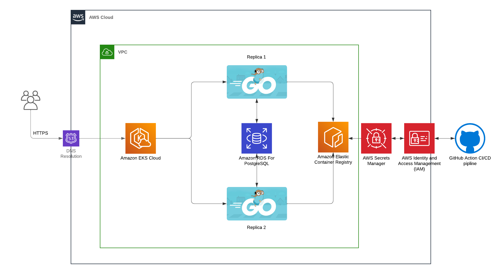

# SavePlus

### Introduction:

- This is the backend service for project SavePlus, our goal is to provide a second-hand trading platform for international student

### Our project architecture:

### Tech stacks we used:

- Built in **`Golang 1.21.5`**
- Uses [Gin](https://github.com/gin-gonic/gin) as web framework
- Uses [Viper](https://github.com/spf13/viper) to manage the configurations.
- Uses [Sqlc](https://github.com/sqlc-dev/sqlc) to generate SQLs
- Usee [pgx/v5](https://github.com/jackc/pgx) as database driver for [postgreSQL]()
- Uses [Docker](https://github.com/docker) to containerize our application
